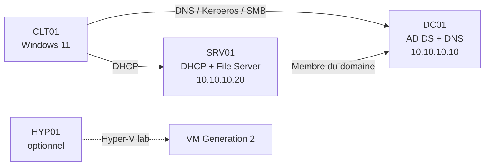

# T1 — Administration et maintenance Windows Server

> **B3 Systèmes, Réseaux & Cloud — 12 h (8 séances × 1 h 30)**  
> Format : **2 h de concepts / démonstrations + ~10 h de travaux pratiques**  
> Plateforme cible : **Windows Server 2022 ou 2025 + Windows 11 Pro**

Ce dépôt fournit un module complet prêt à enseigner et à publier sur GitHub. Le fil rouge place les étudiants dans le rôle d'une petite équipe infrastructure : **construire, sécuriser, automatiser, maintenir puis dépanner** un socle Windows Server.

Le cours respecte le programme B3 fourni par l'école : Active Directory, gestion de l'AD, partage de fichiers/NTFS, DNS, DHCP, notions de routage, Hyper-V, PowerShell et positionnement de WSUS/WDS.

## Objectifs pédagogiques

À la fin des 12 h, l'étudiant doit être capable de :

- expliquer le rôle d'AD DS, DNS, DHCP, SMB/NTFS, GPO, Hyper-V et PowerShell ;
- déployer et valider un domaine Active Directory fonctionnel ;
- organiser les identités avec OU, groupes et une logique **AGDLP** ;
- joindre serveurs et postes au domaine et appliquer des GPO correctement ciblées ;
- construire un serveur de fichiers en appliquant le moindre privilège ;
- distribuer une configuration IPv4 cohérente avec DHCP et diagnostiquer un problème DNS ;
- automatiser un onboarding avec un script PowerShell relançable et contrôlé ;
- effectuer des contrôles de maintenance et produire un mini health-check ;
- comprendre l'architecture Hyper-V et réaliser le mini-lab lorsqu'une virtualisation imbriquée est disponible ;
- appliquer une méthode de diagnostic structurée et prouver une cause racine.

## Fil rouge — NovaCorp

Vous êtes l'équipe infrastructure de **NovaCorp**, une PME qui ouvre un nouveau site.



Domaine : `novacorp.test`  
NetBIOS : `NOVACORP`  
Réseau de lab : `10.10.10.0/24`

## Planning — 8 séances de 1 h 30

| Séance | Contenu | Format | Livrable / checkpoint |
|---|---|---|---|
| **S1** | Windows Server, rôles, AD DS, DNS, GPO, permissions, DHCP, PowerShell | **90 min slides + démos** | Concepts indispensables acquis |
| **S2** | Hyper-V, maintenance, WSUS/WDS, méthode de diagnostic puis TP1 | **30 min slides + 60 min TP** | Domaine `novacorp.test` + DNS AD |
| **S3** | TP2 — OU, utilisateurs, groupes, AGDLP et GPO | **90 min TP** | AD structuré + 2 GPO validées |
| **S4** | TP3 — Serveur de fichiers, SMB et NTFS | **90 min TP** | Matrice de droits + tests multi-profils |
| **S5** | TP4 — DHCP, DNS et intégration client | **90 min TP** | Bail DHCP, DNS direct/inverse, incident minute |
| **S6** | TP5 — PowerShell et onboarding CSV | **90 min TP** | Script relançable + rapport / `-WhatIf` |
| **S7** | TP6 — Maintenance, health-check et Hyper-V | **90 min TP** | Rapport santé + mini-lab Hyper-V ou voie alternative |
| **S8** | TP7 — Incident final / break-fix + restitution | **90 min challenge** | Cause racine prouvée + mesure préventive |

> Le deck PowerPoint dure environ **2 h**. Pause pédagogique recommandée **après la slide 16** : S1 s'arrête là, puis S2 reprend les slides 17 à 24 pendant ~30 min avant de lancer TP1.

## Arborescence

```text
.
├── README.md
├── PUBLISH.md
├── docs/
│   ├── instructor-guide.md
│   ├── session-plan.md
│   ├── prerequisites.md
│   ├── syllabus-alignment.md
│   ├── troubleshooting-cheatsheet.md
│   └── references.md
├── slides/
│   ├── T1-Windows-Server-Administration.pptx
│   ├── T1-Windows-Server-Administration.pdf
│   ├── speaker-notes.md
│   └── generate_slides.js
├── labs/
│   ├── 00-conventions.md
│   ├── 01-build-domain.md
│   ├── 02-ad-structure-gpo.md
│   ├── 03-file-server.md
│   ├── 04-dhcp-dns.md
│   ├── 05-powershell-automation.md
│   ├── 06-maintenance-hyperv.md
│   └── 07-final-incident.md
├── scripts/
│   ├── student/
│   │   ├── 05-provision-users-template.ps1
│   │   └── 06-health-check-template.ps1
│   ├── 00-preflight.ps1
│   ├── 01-dc01-base.ps1
│   ├── 02-create-ad-structure.ps1
│   ├── 03-file-server.ps1
│   ├── 04-dhcp.ps1
│   └── 99-validation.ps1
├── data/
│   └── new-users.csv
├── assessment/
│   ├── qcm.md
│   ├── practical-project.md
│   └── grading-rubric.md
├── challenges/
│   └── README.md
└── instructor/            # pack formateur uniquement, ignoré par Git
    ├── corrections/
    ├── scripts/
    └── incident-cards/
```

## Démarrage rapide étudiant

1. Lire [`docs/prerequisites.md`](docs/prerequisites.md).
2. Créer les trois VMs principales et le réseau de lab.
3. Faire les TP dans l'ordre.
4. Après chaque TP, conserver les **preuves** demandées : commandes, captures, exports ou rapports.
5. Committer régulièrement dans votre fork GitHub.

Exemple :

```bash
git checkout -b tp/prenom-nom
git add .
git commit -m "TP3: SMB et ACL NovaCorp validés"
```

## Livrables étudiants

Le rendu minimal contient :

- un schéma de l'architecture réellement déployée ;
- les preuves de validation de chaque TP ;
- une matrice groupes / ressources / droits ;
- le script PowerShell final du TP5 ;
- le rapport de santé du TP6 ;
- le compte rendu d'incident du TP7 : symptôme, hypothèses, tests, cause racine, correction, validation, prévention.

## Corrections formateur

Le pack formateur contient `instructor/` avec corrections, scripts complets et cartes d'incidents. Ce dossier est ignoré par Git afin de limiter le risque de publier les réponses.

```bash
git status --ignored
```

Vérifier que `instructor/` apparaît comme ignoré.

## Versions Windows

Les TP ciblent Windows Server 2022/2025. Windows Server 2025 est conseillé en 2026 lorsque l'environnement de l'école le permet. Les TP n'imposent pas Internet après préparation des VMs.

## Licence

Le contenu pédagogique et les scripts de ce dépôt sont fournis sous licence MIT, sauf éléments tiers explicitement cités.
